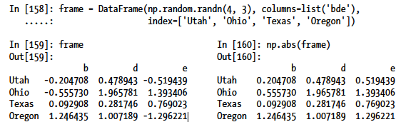
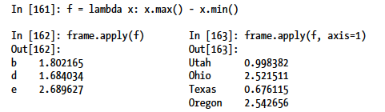
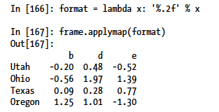
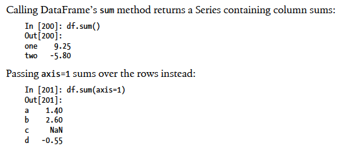
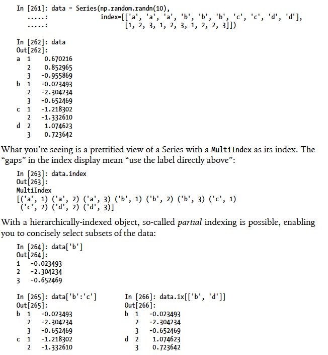

Reading note for _Python for Data Analysis_
========

## Chapter 1

1. Why use Python to do data analysis?

    * Python can work as **glue**. It can integrate _C_, _C++_ and _FORTRAN_ for intense calculation jobs.  
        
    * Python solves the "_Two-Language_" problem. Python works well in both doing research and building products.

2. Essential Python Libraries
    
    * Numpy, short for Numerical Python, is the foundational package for scientific computing
in Python.

    * pandas, combines the high performance array-computing features of NumPy with the
flexible data manipulation capabilities of spreadsheets and relational databases

    * matplotlib, is the most popular Python library for producing plots and other 2D data
visualizations.

    * Scipy, is a collection of packages addressing a number of different standard problem
domains in scientific computing.

## Chapter 2

1. General tasks to to do data analysis

    1. Getting data from outside work.

    2. Data wrangling

    3. Transforming data to useful sets

    4. Modeling and computation

    5. Presenting discoveries

2. Common data operations

    * read and save data

    * turn json data to a list of dictionaries

    * list comprehension, applying an operation to a collection of objects

    * count

    * slice

    * sort

    * merge

## Chapter 4 Numpy Basics

1. Numpy features

    * basic data type is numpy.array

    * do element wise calculation

    * operate on entire arrays of data instead of writting loops

2. numpy.array or ndarray basic operations

    * ndarray is a multidimensional array object

    * creating an ndarray by using the __array__ function. It accpets any sequence-like object.

    > np.array([1, 2, 3])

    * Array creation functions  
    |  Function |                        Descrition                           |
    |-----------|-------------------------------------------------------------|
    |   array   |   Convert input data (list, tuple, array, or other sequence type) to an ndarray either by inferring a dtype or explicitly specifying a dtype. Copies the input data by default|
    |  asarray  |   Convert input to ndarray, but do not copy if the input is already an ndarray |
    |  arange   |   Like the built-in range but returns an ndarray instead of a list|
    | ones, ones_like   |  Produce an array of all 1’s with the given shape and dtype. ones_like takes another array and produces a ones array of the same shape  |
    | zeros, zeros_like  |  Like ones and ones_like but producing arrays of 0’s instead |
    | empty, empty_like  |  Create new arrays by allocating new memory, but do not populate with any values like
    | ones and zeros | Produce an array of all 1’s with the given shape and dtype. ones_like takes another array and produces a ones array of the same shape and dtype |
    |  eye, identity |  Create a square N x N identity matrix (1’s on the diagonal and 0’s elsewhere) |
    

3. Basic indexing and slicing

    * Indexing and slicing is very similar to the python standard. However, because the numpy is designed to operate on large data, the slicing returns _views_ on the orginal array. This means __the data is not copied and any modification to the view will be relflected in the source array__. 

    * If a data set really needs to be copied, use .copy() method

    * Boolean indexing example (does not work in python standard library):

    > x = np.array([True, False, False, True])
    >
    > y = np.array([1, 2, 3, 4])
    >
    > y[x]
    >
    > [1, 4]

    x could also be replaced by operations on ndarrays which returns boolean ndarrays

    * Fancy Indexing example, directly select the elements according to the input ndarray sequence (does not work in python standard library)

    > x = np.array([0, 1])
    >
    > y = np.array([1, 2, 3])
    >
    > y[x]
    >
    > [1, 3]

    * .reshape method: change the ndarray to required rows and cols

4. Universal Functions

    * .abs, .sqrt, .exp, .cos ... operations are element wise

5. Data Processing Using Arrays

    * np.meshgrid(ndarray1, ndarray2) creates a len(ndarray1)Xlen(ndarray2) net

    * np.where(condition array, xarr, yarr): expression __x__ if __condition__ else __y__

6. Mathematical and Satistical Methods

    * .sum, .mean, .min, .std, .var ...

    * .cumsum: cumulative sum of elements starting from 0

    * .cumprod: cumulative product of elements starting from 0

7. Sorting
    
    * .sort(): from small to large

8. Unique
    
    * np.unique(x): compute the sorted, unique elements in x

9. Linear Algebra

    * ndarray.T: compute the transpose of the ndarray. __Attention__: for 1D ndarray, the .T method returns the same 1D ndarray. To get the proper transpose ndarray, use .reshape method.

    * .dot method, used to do the inner product operation

10. Random Number Generation

    * numpy.random functions
    | Function |                        Descrition                          |
    |-----------|-------------------------------------------------------------|
    |  seed    |  Seed the random number generator   |
    |  permutation    |  Return a random permutation of a sequence, or return a permuted range   |
    |  shuffle    |  Randomly permute a sequence in place   |
    |  rand    |  Draw samples from a uniform distribution   |
    |  randint    |  Draw random integers from a given low-to-high range   |
    |  randn    |  Draw samples from a normal distribution with mean 0 and standard deviation 1   |
    |  bionomial    |  Draw samples a binomial distribution   |
    |  normal    |  Draw samples from a normal (Gaussian) distribution   |
    |  beta    |  Draw samples from a beta distribution   |
    |  chisquare    |  Draw samples from a chi-square distribution   |
    |  gamma    |  Draw samples from a gamma distribution   |
    |  uniform    |   Draw samples from a uniform [0, 1) distribution  |

## Chapter 5 Getting started with pandas

1. Motivation to create pandas or the functions pandas primarily provides

    * automatic or expicit data alignment, to prevent common errors resulting from misaligned data from different sources.

    * Integreated time series functionality

    * flexible handling of missing data

    * arithmetric operations and reductions on axis labels

    * merge or other relational operations in popular databases 

2. The most two important classes in pandas

    * Series: one-dimensional array-like object containing an arrya of data and an associated array of data labels called __index__. 

        > obj = Series([4, 7, -5, 3])

        > obj

        > 0 4
        >
        > 1 7
        >
        > 2 -5
        >
        > 3 3

        obj.values() can be used to check the contents and obj.index() can be used to check the indexes.

    * DataFrame: represents a tabular, spreadsheet-like data structure containing an ordered collection of columns, each of which can be a different value type (numeric,string, boolean, etc.). Similar to Series, DataFrame also has indexes. More than that, it also have __columns__ which is to mark each column. 

      Although the author says the row-oriented operation and col-oriented operation are treated roughly equally in DataFrame, I feel the DataFrame is more col-oriented treated.

      Possible data inputs to DataFrame constructor
      |    Type   |                             Notes                           |
      |-----------|-------------------------------------------------------------|
      |2D ndarray | A matrix of data, passing optional row and column labels |
      |dict of arrays, lists, or tuples | Each sequence becomes a column in the DataFrame. All sequences must be the same length.|
      |NumPy structured/record array |Treated as the “dict of arrays” case|
      |dict of Series |Each value becomes a column. Indexes from each Series are unioned together to form the result’s row index if no explicit index is passed.|
      |dict of dicts | Each inner dict becomes a column. Keys are unioned to form the row index as in the “dict of Series” case.|
      |list of dicts or Series | Each item becomes a row in the DataFrame. Union of dict keys or Series indexes become the DataFrame’s column labels|
      |List of lists or tuples | Treated as the “2D ndarray” case|
      |Another DataFrame | The DataFrame’s indexes are used unless different ones are passed|
      |NumPy MaskedArray | Like the “2D ndarray” case except masked values become NA/missing in the DataFrame result|

      __Attention__: The column returned when indexing a DataFrame is a view on the underlying data, not a copy. Thus, any in-place modifications to the Series will be reflected in the DataFrame. The column can be explicitly copied using the Series’s copy method.

3. Essential functionality
    
    * Reindexing: create a new index for the data

        How to apply
        > (suppose obj is a Series or DataFrame)
        >
        > obj.reindex(tuple or list)

        There is "method" parameter in reindex method. You can choose how to fill values when reindexing. 

        reindex method options
        |    Argument  |                             Notes                           |
        |-----------|-------------------------------------------------------------|
        |ffill or pad | Fill (or carry) values forward|
        |bfill or backfill | Fill (or carry) values backward|

    * Dropping entries from an axis
    
        > obj.drop(entry name)   (for Series)
        >
        > obj.drop(entry name, axis = 0 or 1)   (for DataFrame)

    * Indexing, selection and filtering

      For Series, the indexing operaiton is very similar to numpy.array. But more than ordinary numpy.array indexing, one can also refer to the index of Series for indexing.

      For DataFrame, the indexing into a DataFrame is fro retrieving one or more columns. To retrieve rows, one can use the _.ix[]_ method

      For both Series and DataFrame, boolean indexing is working.

    * Arithmetic and data alignment

      When adding together objects, if any index pairs are not the same, the respective index in the result will be the union of the index pairs.

    * Function application and mapping

        
        
        

        __Attentions__: _apply_ works on a row / column basis of a DataFrame, _applymap_ works element-wise on a DataFrame, and _map_ works element-wise on a Series.

    * Sorting and ranking

        * sort_index method, sort by index, "by" parmeter can decide to sort by which __columns__.

        * order method, sort a Series by its values

        * rank method, return the ranks with the values.

    * Axis indexes with duplicate values

        Indexing a value with multiple entries returns a Series while single entries return a scalar.

    * Summarizing and Computing Descriptive Statistics

        Example: 

        

        Summary statistics
        |    Method |                             Notes                           |
        |-----------|-------------------------------------------------------------|
        |count |Number of non-NA values|
        |describe |Compute set of summary statistics for Series or each DataFrame column|
        |min, max |Compute minimum and maximum values|
        |argmin, argmax |Compute index locations (integers) at which minimum or maximum value obtained, respectively|
        |idxmin, idxmax |Compute index values at which minimum or maximum value obtained, respectively|
        |quantile |Compute sample quantile ranging from 0 to 1|
        |sum |Sum of values|
        |mean |Mean of values|
        |median |Arithmetic median (50% quantile) of values|
        |mad |Mean absolute deviation from mean value|
        |var |Sample variance of values|
        |std |Sample standard deviation of values|
        |skew |Sample skewness (3rd moment) of values|
        |kurt |Sample kurtosis (4th moment) of values|
        |cumsum |Cumulative sum of values|
        |cummin, cummax |Cumulative minimum or maximum of values, respectively|
        |cumprod |Cumulative product of values|
        |diff |Compute 1st arithmetic difference (useful for time series)|
        |pct_change |Compute percent changes|

    * Unique Values, Value Counts, and Membership

        |    Method |                             Notes                           |
        |-----------|-------------------------------------------------------------|
        |isin |Compute boolean array indicating whether each Series value is contained in the passed sequence of values.|
        |unique |Compute array of unique values in a Series, returned in the order observed.|
        |value_counts |Return a Series containing unique values as its index and frequencies as its values, ordered count in descending order.|

    * Handling Missing Data

        |    Method |                             Notes                           |
        |-----------|-------------------------------------------------------------|
        |dropna |Filter axis labels based on whether values for each label have missing data, with varying thresholds for how much missing data to tolerate.|
        |fillna |Fill in missing data with some value or using an interpolation method such as 'ffill' or 'bfill'.|
        |isnull |Return like-type object containing boolean values indicating which values are missing / NA.|
        |notnull |Negation of isnull.|

    * Filling in Missiong Data

        fillna function arguments
        |    Arugument|                             Notes                           |
        |-----------|-------------------------------------------------------------|
        |value |Scalar value or dict-like object to use to fill missing values|
        | method |Interpolation, by default 'ffill' if function called with no other arguments|
        |axis| Axis to fill on, default axis=0|
        |inplace |Modify the calling object without producing a copy|
        |limit| For forward and backward filling, maximum number of consecutive periods to fill|

    * Hierarchical indexing

        

## Chapter 6 Data Loading, Storage, and File Formats

1. Parsing functions in pandas

    |   Function |                             Notes                           |
    |-----------|-------------------------------------------------------------|
    |read_csv | Load delimited data from a file, URL, or file-like object. Use comma as default delimiter |
    |read_table | Load delimited data from a file, URL, or file-like object. Use tab ('\t') as default delimiter |
    |read_fwf | Read data in fixed-width column format (that is, no delimiters) |
    |read_clipboard | Version of read_table that reads data from the clipboard. Useful for converting tables from web pages |

2. Common functions to accomplish when loading data

    * Indexing

    * Infer the data type and convert the data type

    * Parse datatime 

    * Iterate

    * Clean data

3. read_csv / read_table function arguments
    
    |   Function |                             Notes                           |
    |-----------|-------------------------------------------------------------|
    |path | String indicating filesystem location, URL, or file-like object |
    |sep or delimiter | Character sequence or regular expression to use to split fields in each row |
    |header | Row number to use as column names. Defaults to 0 (first row), but should be None if there is no header row |
    |index_col | Column numbers or names to use as the row index in the result. Can be a single name/number or a list of them for a hierarchical index |
    |names | List of column names for result, combine with header=None |
    |skiprows | Number of rows at beginning of file to ignore or list of row numbers (starting from 0) to skip |
    |na_values | Sequence of values to replace with NA |
    |comment | Character or characters to split comments off the end of lines |
    |parse_dates | Attempt to parse data to datetime; False by default. If True, will attempt to parse all columns. Otherwise can specify a list of column numbers or name to parse. If element of list is tuple or list, will combine multiple columns together and parse to date (for example if date/time split across two columns) |
    |keep_date_col | If joining columns to parse date, drop the joined columns. Default True |
    |converters | Dict containing column number of name mapping to functions. For example {'foo': f} would apply the function f to all values in the 'foo' column |
    |dayfirst | When parsing potentially ambiguous dates, treat as international format (e.g. 7/6/2012 -> June 7, 2012). Default False |
    |date_parser | Function to use to parse dates |
    |nrows | Number of rows to read from beginning of file |
    |iterator | Return a TextParser object for reading file piecemeal |
    |chunksize | For iteration, size of file chunks |
    |skip_footer | Number of lines to ignore at end of file |
    |verbose | Print various parser output information, like the number of missing values placed in non-numeric columns |
    |encoding | Text encoding for unicode. For example 'utf-8' for UTF-8 encoded text |
    |squeeze | If the parsed data only contains one column return a Series |
    |thousands | Separator for thousands, e.g. ',' or '.' |

4. Writing Data Out to Text Format

    > data.to_csv('output.csv')  ( data could be DataFrame or Series)

5. basics about converting JSON data

    > import json
    >
    > data = json.loads(obj) (obj is a json object, this is to convert json to python object)
    >
    > output = json.dumps(data)   (convert python object to json object)

6. Web Sraping

    example 1: find all the URL with tag "a" in the HTML 

    > from lxml.html import parse
    >
    > from urllib2 import urlopen
    >
    > parsed = parse(urlopen('http://finance.yahoo.com/q/op?s=AAPL+Options'))
    >
    > doc = parsed.getroot()
    >
    > urls = [lnk.get('href') for lnk in doc.findall('.//a')]

    example 2: turn records in XML into DataFrame

    > from lxml import objectify
    >
    > path = 'Performance_MNR.xml'
    >
    > parsed = objectify.parse(open(path))
    >
    > root = parsed.getroot()
    >
    > data = []
    >
    > skip_fields = ['PARENT_SEQ', 'INDICATOR_SEQ', 'DESIRED_CHANGE', 'DECIMAL_PLACES']
    >
    > for elt in root.INDICATOR:
    >
    > ----el_data = {}
    > 
    > --------for child in elt.getchildren():
    > 
    > ------------if child.tag in skip_fields:
    >
    > ----------------continue
    >
    > ------------el_data[child.tag] = child.pyval
    >
    > --------data.append(el_data)

7. Binary Data Formats (skip)

8. Read Microsoft Excel

    > xls_file = pd.ExcelFile('data.xls')
    >
    > table = xls_file.parse('Sheet1')

9. Interact with HTML and API

    example:

    > import requests
    >
    > url = 'http://search.twitter.com/search.json?q=python%20pandas'
    >
    > resp = requests.get(url)
    >
    > import json
    >
    > data = json.loads(resp.text)

10. Interact with SQL

    > import sqlite3
    >
    > query = """CREATE TABLE test (a VARCHAR(20), b VARCHAR(20), c REAL, d INTEGER);"""
    >
    > con = sqlite3.connect(":memory:")
    > 
    > con.execute(query)
    >
    > con.commit()

    ....

11. Interact with MongoDB

    > import pymongo
    >
    > con = pymongo.Connection('localhost', port=27017)
    >
    > tweets = con.db.tweets
    >
    > import requests, json
    >
    > url = 'http://search.twitter.com/search.json?q=python%20pandas'
    >
    > data = json.loads(requests.get(url).text)
    >
    > for tweet in data['results']:
    >
    > ----tweets.save(tweet)
    >
    > cursor = tweets.find({'from_user': 'wesmckinn'})
    >
    > tweet_fields = ['created_at', 'from_user', 'id', 'text']
    >
    > result = DataFrame(list(cursor), columns=tweet_fields)

## Chapter 7 Data Wrangling: Clean, Transform, Merge, Reshape

1. pd.merge() method: very similar to the join command in SQL

    * merge function arguments
    |Argument |                            Description                          |
    |-----------|-------------------------------------------------------------|
    |left |DataFrame to be merged on the left side|
    |right |DataFrame to be merged on the right side|
    |how |One of 'inner', 'outer', 'left' or 'right'. 'inner' by default|
    |on | Column names to join on. Must be found in both DataFrame objects. If not specified and no other join keys given, will use the intersection of the column names in left and right as the join keys|
    |left_on | Columns in left DataFrame to use as join keys|
    |right_on |Analogous to left_on for left DataFrame|
    |left_index |Use row index in left as its join key (or keys, if a MultiIndex)|
    |right_index | Analogous to left_index|
    |sort |Sort merged data lexicographically by join keys; True by default. Disable to get better performance in some cases on large datasets|
    |suffixes |Tuple of string values to append to column names in case of overlap; defaults to ('_x', '_y'). For example, if 'data' in both DataFrame objects, would appear as 'data_x' and 'data_y' in result|
    |copy | If False, avoid copying data into resulting data structure in some exceptional cases. By default always copies|

2. instance.join() method: 

    * DataFrame’s join method performs a left join on the join keys.

    * parameters are very similar to merge method

3. concatenating along a axis

    * np.concatenate([array1, array2,..], axis = 1 or 2) is simple concatenating. pd.concat is more complex

    * think about the indexes in DataFrame. It also plays an important role in concatenating. The concatenatin uses indexes to find which entries needed to be lined up.

    * pd.concat() can do a lot of things that pd.merge() can do.

    * concat function arguments
    |Argument |                            Description                          |
    |-----------|-------------------------------------------------------------|
    |objs| List or dict of pandas objects to be concatenated. The only required argument|
    |axis |Axis to concatenate along; defaults to 0|
    |join| One of 'inner', 'outer', defaulting to 'outer'; whether to intersection (inner) or union (outer) together indexes along the other axes|
    |join_axes |Specific indexes to use for the other n-1 axes instead of performing union/intersection logic|
    |keys| Values to associate with objects being concatenated, forming a hierarchical index along the concatenation axis. Can either be a list or array of arbitrary values, an array of tuples, or a list of arrays (if multiple level arrays passed in levels)|
    |levels |Specific indexes to use as hierarchical index level or levels if keys passed|
    |names| Names for created hierarchical levels if keys and / or levels passed|
    |verify_integrity |Check new axis in concatenated object for duplicates and raise exception if so. By default (False) allows duplicates|
    |ignore_index |Do not preserve indexes along concatenation axis, instead producing a new range(total_length) index|

4. combining overlapping data

    * use a.combine_first(b) method. If there is overlap, returns the entry in a.

5. 